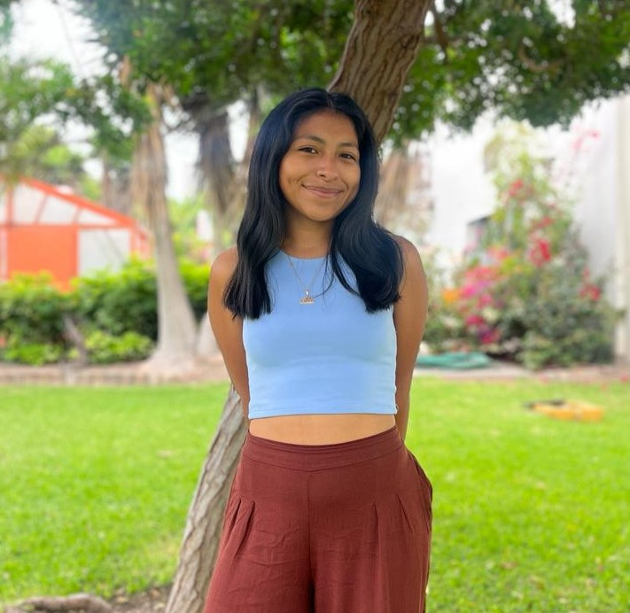
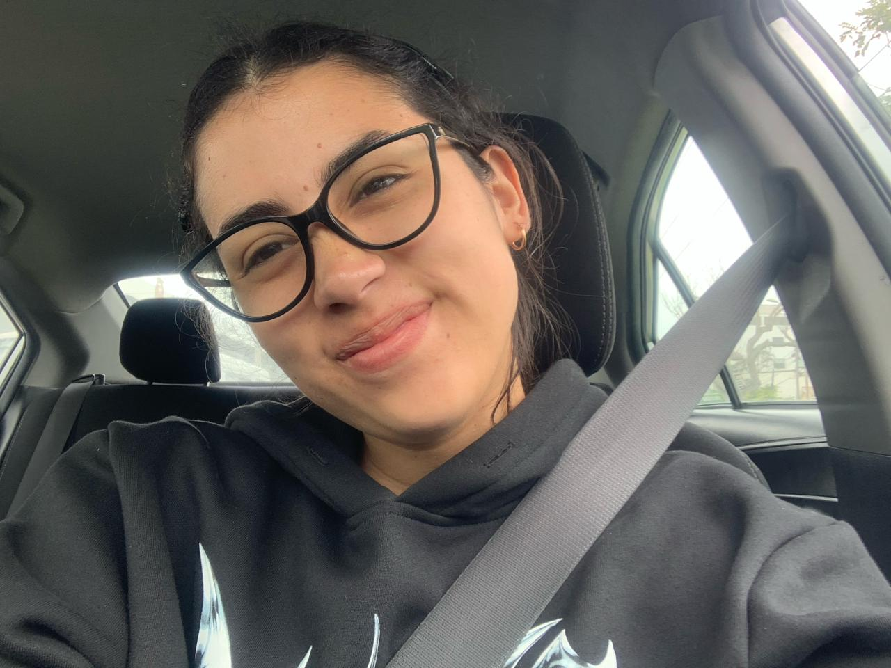

<h1 style="text-align: center;">INTRODUCCIÓN A SEÑALES BIOMÉDICAS - GRUPO 2</h1>

Bienvenidos al repositorio del **Grupo 2** del curso *Introducción a Señales Biomédicas*. Somos un equipo de estudiantes de Ingeniería Biomédica de las universidades UPCH y PUCP del semestre 2024-1. 

Se buscará desarrollar un sistema en el que se pueda adquirir y procesar señales de un electrocardiograma (ECG).

<h2 style="text-align: center;">Tabla de Contenidos</h2>

1. [Contenidos del Curso](#Contenido)
2. [Materiales](#Materiales)
3. [Tema del Proyecto](#Tema)
4. [Integrantes del Grupo](#Integrantes)
5. [Docentes del Curso](#Docentes)

  
<h2 style = "text-align: center;">Contenido del Curso</h2>
El curso consta de las siguientes 3 unidades:

##### 1° Unidad: Introducción y adquisición de las señales EMG, ECG y EEG.

##### 2° Unidad: Procesamiento y análisis de señales ECG, EMG y EEG.

##### 3° Unidad: Introducción al análisis de datos estructurados e inteligencia artificial.

<h2 style = "text-align: center;">Materiales</h2>

<h2 style = "text-align: center;">Tema del Proyecto</h2>
Proyecto_: "Analisis de señales electrocardiográficas (ECG)"

<h2 style = "text-align: center;">Integrantes</h2>

1. Catherine Boggio (colabodora)

    Contacto: catherine.boggio@upch.pe

   Estudiante de 8vo ciclo de la carrera de Ingeniería Biomédica en PUCP-UPCH. Mi área de interes es Ingenieria Clínica y mi objetivo en esa rama es poder ayudar a la mayor cantidad de personas tanto del Perú como en el mundo.
   

2. Melany Cama (colaboradora)

    Contacto: melany.cama@upch.pe

    Estudiante de 8vo ciclo, perteneciente al 5to superior. Mi objetivo es obtener experiencia en Gestión Clínica y utilizar mis habilidades para aplicar tecnologías médicas que beneficien a poblaciones vulnerables, contribuyendo así a transformar la salud en el Perú.

3. Alessandra Valle Montoya (colaboradora)

    Contacto: alessandra.valle@upch.pe

   Estudiante de ingeniería biomédica del convenio PUCP-UPCH, Mi enfoque se centra en la Ingeniería Clínica e Biomecánica y Rehabilitacións. Mi objetivo es trabajar en el diseño y desarrollo de dispositivos médicos innovadores, especificamente, prótesis.

4. Juan José Sandoval (colaborador)

    Contacto: juan.sandoval@upch.pe
    
    Estudiante de octavo ciclo de la carrera de Ingeniería Biomédica PUCP-UPCH. Mi área de interés es Ingeniería de tejidos e Ingeniería Clínica. Mi objetivo es poder trabajar con nanomateriales y en el desarrollo de dispositivos médicos para mejorar la calidad de vida en el país.

<h2 style = "text-align: center;">Docentes del Curso</h2>

1. De la Cruz Rodriguez, Lewis - umbert.de.la.cruz@upch.pe
2. Meza Rodriguez, Moises - moises.meza@upch.pe
3. Venancio Huerta, Julissa - julissa.venancio@upch.pe
4. Cáceres del Aguila, Jose Alonso - jose.caceres.d@upch.pe

